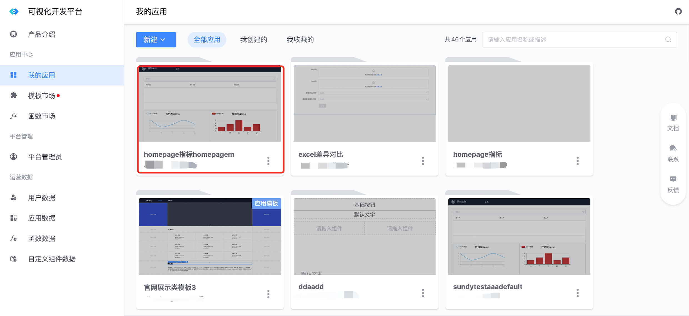
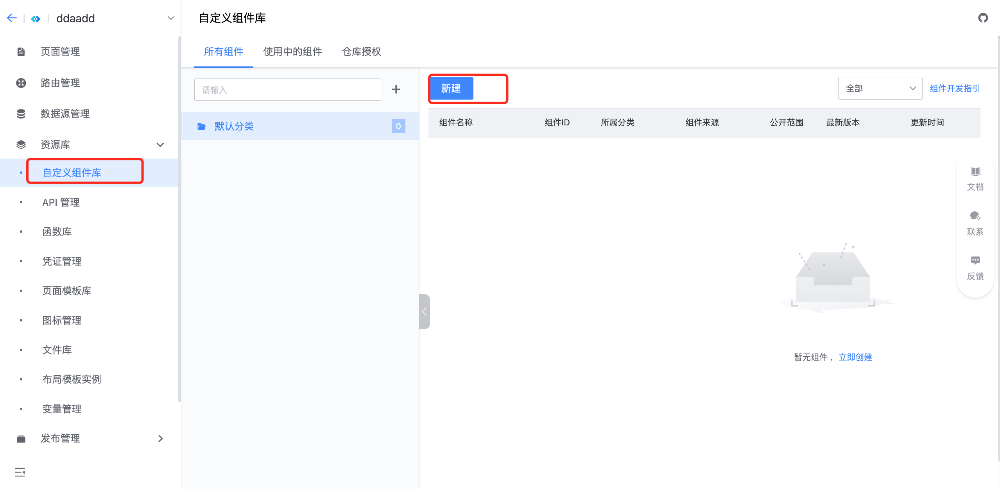
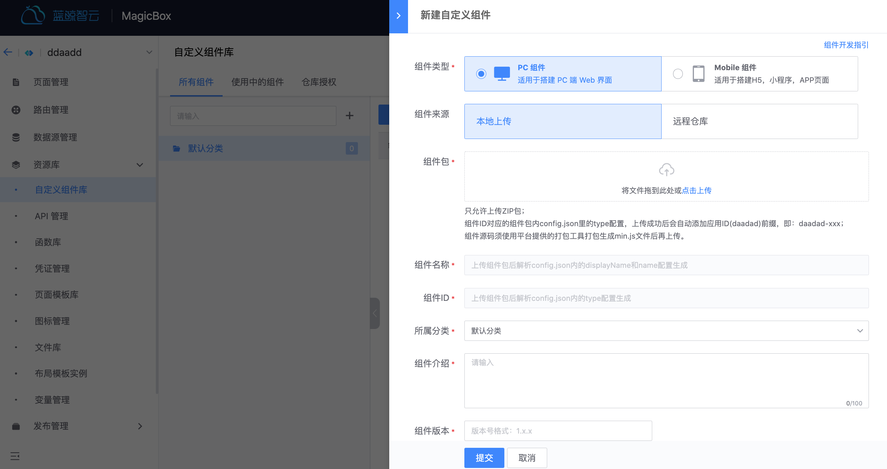
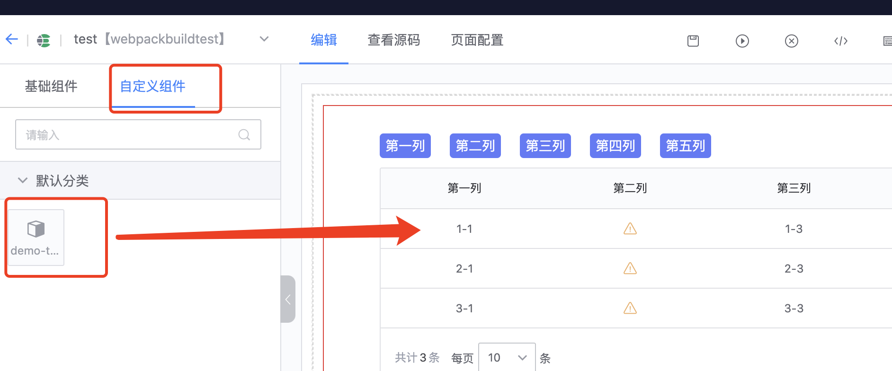
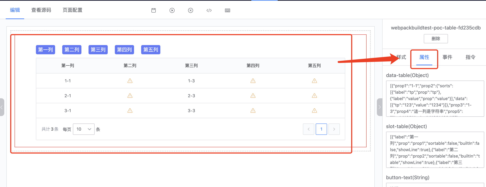

---
[](https://github.com/TencentBlueKing/lesscode-custom-components/blob/master/LICENSE.txt) [](https://github.com/TencentBlueKing/lesscode-custom-components/releases) [](https://github.com/TencentBlueKing/lesscode-custom-components/pulls)

[English](readme_en.md) | 简体中文
## LESSCODE-CUSTOM-COMPONENTS
蓝鲸智云可视化开发平台(LessCode)，自定义组件框架。

### 组件升级
```bash
1. 一定需要下载平台提供的开发框架

2. 将原来的业务代码复制到 `src/`目录下

3. `config.json`文件添加`framework`字段，标明自定义组件使用的框架，可以填 vue2 或者 vue3

4. 参照开发文档进行组件开发和构建
```

### 自定义组件工程文件结构

```bash
|-- ROOT                    # 自定义组件根目录
    |-- src/                # 编写自定义组件目录
        |-- config.json     # 必须。组件能力配置，自定义组件暴露给 lesscode 的能力说明
        |-- index.vue       # 必须。组件实现源码
        |-- components/     # 推荐。引用的子组件目录
        |   ......          # ajax mock 的实现
        |-- doc/            # 蓝鲸前端开发脚手架的文档工程，这里的细节与实际工程无关，就不详细介绍了，如有兴趣，可自行查看（doc 里的内容不会影响到实际的工程）
        |   ......
        |-- statics/        # 推荐。静态资源目录
        |   ......
```

### config.json（暴露给 LessCode 的能力配置）

<table class="table">
    <tr>
        <th>字段 name</th>
        <th>类型 type</th>
        <th>描述 describe</th>
    </tr>
    <tr>
        <td>type</td>
        <td>String</td>
        <td>源码中展示的标签名（只支持小写英文字母）</td>
    </tr>
    <tr>
        <td>name</td>
        <td>String</td>
        <td>页面展示的英文名</td>
    </tr>
    <tr>
        <td>framework</td>
        <td>String</td>
        <td>组件使用的框架</td>
    </tr>
    <tr>
        <td>displayName</td>
        <td>String</td>
        <td>页面展示的中文名</td>
    </tr>
    <tr>
        <td>events</td>
        <td>Array</td>
        <td>组件支持的自定义事件</td>
    </tr>
    <tr>
        <td>styles</td>
        <td>
            Array，可选值如下：
            <p>display: 生成的框的类型</p>
            <p>size: css 盒模型（width, height）</p>
            <p>padding: css 盒模型内边距</p>
            <p>margin: css 盒模型外边距</p>
            <p>font: 字体</p>
            <p>border: 边框</p>
        </td>
        <td>支持的 css 样式设置</td>
    </tr>
    <tr>
        <td>props</td>
        <td>Object</td>
        <td>组件支持的属性配置</td>
    </tr>
    <tr>
        <td>directives</td>
        <td>Array</td>
        <td>支持的指令配置</td>
    </tr>
</table>

#### events —— 组件内部支持 vue 的自定义事件（this.$emit('click')），配置希望那些事件可以暴露给 LessCode

```js
// events
{
    ...
    events: [
        {
            name: 'click', // 组件支持点击事件
            tips: '响应组件的点击事件' // 事件功能描述
        },
        {
            name: 'foucs', // 组件支持获得焦点事件
            tips: '响应组件的获得焦点事件' // 事件功能描述
        }
    ]
}
```

#### props —— 组件支持配置那些 props（与 vue 自定义组件使用方式保持一致）

```js
// props
{
    ...
    // 组件支持配置 value
    value: {
        type: 'string', // 类型（string、number、array、object、boolean）
        val: 'hello world !!!', // 默认值
        options: [] // 值可选列表
        tips: '空白提示', // 数据使用描述
    }
}
```

#### directives —— 支持配置那些指令

```js
// directives
{
    [
        ...
        {
            type: 'v-bind', // 指令类型
            prop: 'disabled', // 指令所绑定的属性
            val: '', // 指令绑定的变量名
            modifiers: ['sync'], // 指令修饰符，该字段可选
            defaultVal: false // 指令绑定变量的默认值
        }
    ]
}
```

### 本地调试

```bash
1. 安装依赖
npm i 

2. 本地开发
npm run dev

3. 编写组件逻辑，并进行测试
```

### 构建
```bash
1. 执行构建命令
npm run build

2. 构建完成后，/zip 目录下会构建出自定义组件
```

### 上传

#### 登录蓝鲸可视化开发平台

> 已登陆可回到首页

#### 选择一个应用，进入应用管理

> 在应用列表中选择将要编辑的应用，或者新建一个应用（应用创建成功会自动进入到应用管理页面）


#### 新建自定义组件

> 在左侧可选 tab 中选中自定义组件管理，进入自定义组件管理页面
>
> 点击新建按钮进行自定义组件上传操作，如果已上传过自定义组件会展示已上传的自定义组件可以在当前页面进行自定义组件管理操作
>
> 使用中的组件 tab 会展示自定义的使用记录



#### 上传自定义组件（component-project.zip）

> 点击新建按钮会出现自定义组件新建弹框
>
> 操作表单第一项选择将要上传的自定义组件包（component-project.zip，构建后位于 /zip 文件夹下）
>
> 上传成功后会自动解析自定义组件包中的 config.json，返回提供的 type、name、displayName 并自动回填到对应的表单项中



### 使用

#### 指定使用组件的页面
> 在应用页面列表中选择将要编辑的页面，或者新建一个页面来编辑

#### 拖拽组件
> 上传的组件在页面编辑页面会自动注册
>
> 进入页面编辑页面选中自定义组件 tab
>
> 找到将要使用的组件拖拽到编辑区



#### 编辑组件功能
> 在编辑区选中将要操作的组件
>
> 在右侧配置面板选中将进行的操作 tab 完成页面功能配置



## BlueKing Community
- [BK-CMDB](https://github.com/Tencent/bk-cmdb)：蓝鲸配置平台（蓝鲸 CMDB）是一个面向资产及应用的企业级配置管理平台。

- [BK-CI](https://github.com/Tencent/bk-ci)：蓝鲸持续集成平台是一个开源的持续集成和持续交付系统，可以轻松将你的研发流程呈现到你面前。

- [BK-BCS](https://github.com/Tencent/bk-bcs)：蓝鲸容器管理平台是以容器技术为基础，为微服务业务提供编排管理的基础服务平台。

- [BK-PaaS](https://github.com/Tencent/bk-paas)：蓝鲸 PaaS 平台是一个开放式的开发平台，让开发者可以方便快捷地创建、开发、部署和管理 SaaS 应用。

- [BK-SOPS](https://github.com/Tencent/bk-sops)：标准运维（SOPS）是通过可视化的图形界面进行任务流程编排和执行的系统，是蓝鲸体系中一款轻量级的调度编排类 SaaS 产品。

- [BK-JOB](https://github.com/Tencent/bk-job) 蓝鲸作业平台(Job)是一套运维脚本管理系统，具备海量任务并发处理能力。

## Contributing
- Please read [Contributing(In Chinese)](docs/CONTRIBUTING.md) for the branch management, issue and pr specifications of lesscode-custom-components.
- [Tencent Open Source Incentive Program](https://opensource.tencent.com/contribution) encourages the participation and contribution of developers. We look forward to having you join it.

## License
Based on the MIT license. Please refer to [LICENCE](LICENSE.txt) for details.
