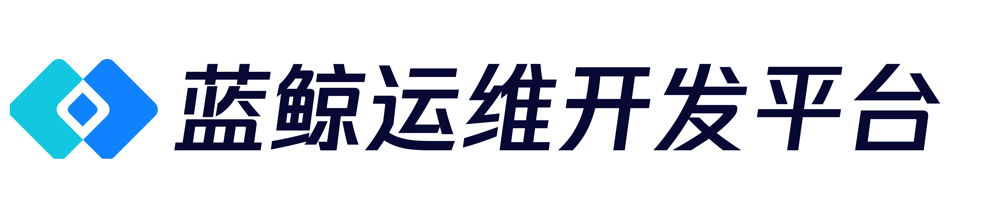

---
[](https://github.com/TencentBlueKing/lesscode-custom-components/blob/master/LICENSE.txt) [](https://github.com/TencentBlueKing/lesscode-custom-components/releases) [](https://github.com/TencentBlueKing/lesscode-custom-components/pulls)

English | [简体中文](readme.md)

## LESSCODE-CUSTOM-COMPONENTS
Blue Whale SmartCloud visual development platform (LessCode), custom component framework.

### Component Upgrade
```bash
1. You must download the development framework provided by the platform

2. Copy the original business code to the `src/` directory

3. Add a `framework` field to the `config.json` file to indicate the framework used by the custom component, you can fill in vue2 or vue3

4. Component development and building with reference to development documentation
```

### Customized component project file structure

```bash
|-- ROOT                    # Custom component root directory
    |-- src/                # Writing custom component directories
        |-- config.json     # Required. Component capability configuration, description of the capabilities exposed to lesscode by the custom component
        |-- index.vue       # Required. Component Implementation Source Code
        |-- components/     # Recommended. Referenced subcomponents directory
        |   ......          # Implementation of ajax mock
        |   ......
        |-- statics/        # Recommended. Static Resources Directory
        |   ......
```

### config.json (capability configuration exposed to LessCode)

<table class="table">
    <tr>
        <th>Field</th>
        <th>Type</th>
        <th>Describe</th>
    </tr>
    <tr>
        <td>type</td>
        <td>String</td>
        <td>Tag names displayed in the source code (only lowercase letters are supported)</td>
    </tr>
    <tr>
        <td>name</td>
        <td>String</td>
        <td>Page display of English names</td>
    </tr>
    <tr>
        <td>framework</td>
        <td>String</td>
        <td>Framework used by the component</td>
    </tr>
    <tr>
        <td>displayName</td>
        <td>String</td>
        <td>Name of the page display</td>
    </tr>
    <tr>
        <td>events</td>
        <td>Array</td>
        <td>Custom events supported by the component</td>
    </tr>
    <tr>
        <td>styles</td>
        <td>
            Array, with the following optional values:
            <p>display: the type of the generated box</p>
            <p>size: css box model (width, height)</p>
            <p>padding: css box model inner margin</p>
            <p>margin: css box model outer margin</p>
            <p>font: font</p>
            <p>border: border</p>
        </td>
        <td>Supported css style settings</td>
    </tr>
    <tr>
        <td>props</td>
        <td>Object</td>
        <td>Configuration of the properties supported by the component</td>
    </tr>
    <tr>
        <td>directives</td>
        <td>Array</td>
        <td>Supported command configurations</td>
    </tr>
</table>

#### events —— The component internally supports vue's custom events (this.$emit('click')), and the configuration expects those events to be exposed to LessCode

```js
// events
{
    ...
    events: [
        {
            name: 'click', // component supports click events
            tips: 'Response to the component's click event' // description of the event function
        }.
        {
            name: 'foucs', // component supports focus events
            tips: 'Respond to the component's get focus event' // event function description
        }
    ]
}
```

#### props —— the component supports configuration of those props (consistent with the way vue custom components are used)

```js
// props
{
    ...
    // The component supports the configuration of value
    value: {
        type: 'string', // type (string, number, array, object, boolean)
        val: 'hello world !!!' , // default value
        options: [] // optional list of values
        tips: 'blank tips', // description of data usage
    }
}
```

#### directives -- support for configuring those directives

```js
// directives
{
    [
        ...
        {
            type: 'v-bind', // directive type
            prop: 'disabled', // the property to which the directive is bound
            val: '', // the name of the variable bound by the directive
            modifiers: ['sync'], // directive modifiers, this field is optional
            defaultVal: false // The default value of the variable bound by the directive
        }
    ]
}
```

### Local debugging

```bash
1. install dependencies
npm i

2. local development
npm run dev

3. write the component logic and test it
```

### Build
```bash
1. execute the build command
npm run build

2. When the build is complete, custom components will be built in the /zip directory
```

### Upload

#### Login to Blue Whale Visual Development Platform

> Logged in to go back to the home page

#### Select an application and enter the application management

> Select the application you want to edit in the application list, or create a new application (successful application creation will automatically go to the application management page)
! [](docs/imgs/project-list.png)

#### New custom component

> Select Custom component management in the left optional tab to enter the custom component management page
>
> Click New button to upload custom component, if you have already uploaded custom component, you can show the uploaded custom component in the current page to manage custom component.
>
> The in-use component tab will show the usage history of the custom component.

! [](docs/imgs/component-upload.png)

#### Upload custom component (component-project.zip)

> Clicking the New button will bring up the custom component new popup box
>
> The first item in the action form selects the custom component package to be uploaded (component-project.zip, built and located in the /zip folder)
>
> After successful upload, it will automatically parse the config.json in the custom component package, return the type, name and displayName provided and automatically backfill them into the corresponding form items

! [](docs/imgs/component-create.png)

### Use

#### to specify the page where the component will be used
> Select the page to be edited in the list of application pages, or create a new page to edit

#### Drag and drop the component
> The uploaded component is automatically registered on the page editing page
>
> Go to the page edit page and select the custom component tab
>
> Find the component you want to use and drag it to the editing area

! [](docs/imgs/component-use.png)

#### Edit the component function
> Select the component you want to work with in the editing area
>
> Select the action to be performed in the right configuration panel tab Complete the page function configuration

! [](docs/imgs/component-operation.png)

## BlueKing Community
- [BK-CMDB](https://github.com/Tencent/bk-cmdb): BlueKing CMDB is an enterprise-level management platform designed for assets and applications.

- [BK-CI](https://github.com/Tencent/bk-ci): BlueKing Continuous Integration platform is a free, open source CI service, which allows developers to automatically create - test - release workflow, and continuously, efficiently deliver their high-quality products.

- [BK-BCS](https://github.com/Tencent/bk-bcs): BlueKing Container Service is a container-based basic service platform that provides management service to microservice businesses.

- [BK-PaaS](https://github.com/Tencent/bk-paas): BlueKing PaaS is an open development platform that allows developers to efficiently create, develop, set up, and manage SaaS apps.

- [BK-SOPS](https://github.com/Tencent/bk-sops): BlueKing SOPS is a system that features workflow arrangement and execution using a graphical interface. It's a lightweight task scheduling and arrangement SaaS product of the Blueking system.

- [BK-JOB](https://github.com/Tencent/bk-job):BlueKing JOB is a set of operation and maintenance script management platform with the ability to handle a large number of tasks concurrently.

## Contributing
- Please read [Contributing(In Chinese)](docs/CONTRIBUTING.md) for the branch management, issue and pr specifications of lesscode-custom-components.
- [Tencent Open Source Incentive Program](https://opensource.tencent.com/contribution) encourages the participation and contribution of developers. We look forward to having you join it.

## License
Based on the MIT license. Please refer to [LICENCE](LICENSE.txt) for details.
